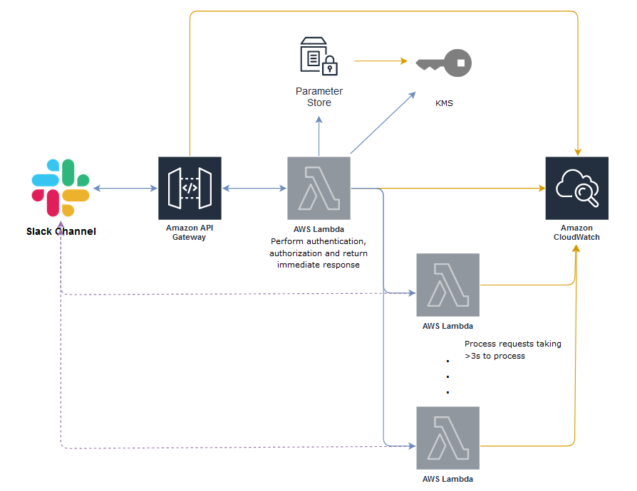

# slack-command-app

This repo provides the source code for building a Slack App/Bot with AWS API Gateway and Lambda Functions.
This SlackApp can handle requests triggered from a [Slash Command](https://api.slack.com/interactivity/slash-commands) which will take longer than [3 seconds](https://api.slack.com/events-api) to process, and posts the details back to the user.

### Overview

### Setup on Slack

To create a **Slack Command** in Slack (the default command in this repo is **`/lookup`**)
1. Navigate to https://api.slack.com/apps.
2. Select **Create New App** and select **Slash Commands**.
3. Enter the name **`/lookup`** for the command and click **Add Slash Command Integration**.
4. Enter the provided API endpoint URL in the URL field.
5. Copy the **Verification Token** from **Basic Information**.

### Deploy to AWS

1. Package and upload the Lambda Function artifacts to S3 with [scripts/upload_artifacts_to_s3.sh](scripts/upload_artifacts_to_s3.sh).
1. Store your Slack token in Parameter Store with [scripts/create_ssm_parameter.py](scripts/create_ssm_parameter.py).
3. Deploy a CloudFormation stack with [cloudformation/slack_command_app_template.yaml](cloudformation/slack_command_app_template.yaml), that creates the following AWS Components.
    1. An API Gateway to provide an endpoint to be invoked from a Slack Command.
    2. A Lambda Function [lambda/slack_app_immediate_response.py](lambda/slack_app_immediate_response.py) to perform authentication, some basic checks and send an intermediate response to Slack within 3 seconds (Slack requirement). This function invokes another Lambda function to to the request tasks (synchronously invocation for quick task; asynchronous invocation for long tasks).
    3. A Lambda Function [lambda/slack_app_async_worker.py](lambda/slack_app_async_worker.py) to perform actual operation that may take more than 3 seconds to finish.
    4. A Lambda Function [lambda/slack_app_sync_worker.py](lambda/slack_app_sync_worker.py) to perform actual operation that takes less than 3 seconds to finish.
    5. A KMS key for encryption in transit for Slack token.
    6. A S3 bucket for storing logs.
